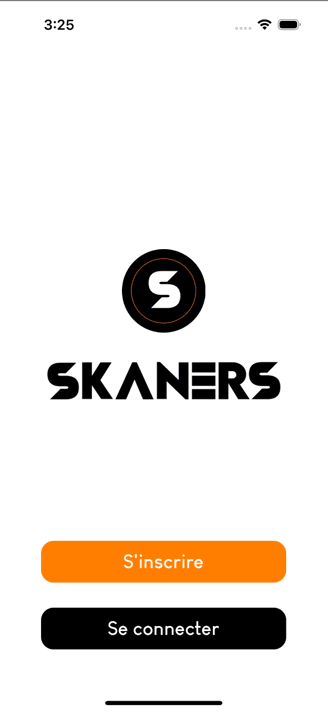

# 👟 SKANERS-FRONT


  <p align=center>
  
   </p>
   

# 🤳Tester l’application

## 💽 Installation

_Expo, c'est à la fois un framework et une plateforme qui simplifient la création et le déploiement d'applications mobiles avec React Native .Expo embarque de nombreux outils utiles et des librairies natives pour React Native. Il gère aussi la mise à jour de ces librairies._

Pour tester l’application vous devez dans un premier temps télécharger puis installer l’application **Expo Go** sur votre téléphone :

[](https://itunes.apple.com/app/apple-store/id982107779) [](https://play.google.com/store/apps/details?id=host.exp.exponent&referrer=www&pli=1)

Une fois l’application téléchargée vous devrez vous créer un compte.

## 📲 Lancement

Il vous suffira ensuite de scanner ce QR-CODE via l’application Expo Go sur Android ou via l’application appareil photo sur IOS :


<aside>


</aside>

Ou d'ouvrir ce lien via votre téléphone : 🔗 [exp://exp.host/@skaners/Skaners?release-channel=default](url)

## 💻 Récupérer le projet en local sur son ordinateur

### 💽 Installer les logiciels nécessaires

Installer un éditeur de code pour consulter le code comme Visual Studio Code par exemple

Installer l'outil Git

Vous pouvez télécharger Visual Studio Code : [](https://code.visualstudio.com/download)

Vous pouvez télécharger Git : [](https://git-scm.com/downloads)

### 📁 Cloner le repository GitHub

Dans le terminal de commande entrez la ligne suivante :

```bash
git clone https://github.com/DevSkaners/skaners-front.git
```

## ⚙️ Installer les dépendances

Yarn a été utiliser pour l’installation des packages.

Une fois le repository cloné vous pouvez entrer dans l’invité de commande et entrer la ligne suivante :

```bash
yarn install
```

## ▶︎ Lancer le projet

Une fois le repository cloné et les dépendances installées il vous suffit d’entrer la commande suivante :

```bash
yarn start
```

Une fois le projet lancé vous devriez obtenir le rendu suivant :

```bash
Starting Metro Bundler
▄▄▄▄▄▄▄▄▄▄▄▄▄▄▄▄▄▄▄▄▄▄▄▄▄▄▄
█ ▄▄▄▄▄ █▄▀ ▀ ▀▄███ ▄▄▄▄▄ █
█ █   █ █   █▀ █▄██ █   █ █
█ █▄▄▄█ █▄█▀ ▄▀▀▄▀█ █▄▄▄█ █
█▄▄▄▄▄▄▄█▄█ █ █ ▀ █▄▄▄▄▄▄▄█
█ ▄  ▀█▄▀ █ ▄ ▀▀██▄██▄ ▄▀▄█
█▀▄█▀▄ ▄ ▀  ▄▄ ▄█▀█ ▀██▀███
█▄██ ▀█▄▄█ ▄▀ ▄█▀▄█ ▄ █ █▀█
█▀▄▀▀▀▀▄▄█ ▀ █▄▀█ ▀▀█▀▀█ ▀█
███▄▄██▄█▀▄ ██▄ ▄ ▄▄▄ ▀▄█▀█
█ ▄▄▄▄▄ ██▀▀▀▄███ █▄█ █▄▄▄█
█ █▄▄▄█ █ █ ▄█▀▄▀▄▀▄█▄▄ ▄██
█▄▄▄▄▄▄▄█▄▄███▄█▄██████▄▄▄█

› Metro waiting on exp://192.168.86.64:19000
› Scan the QR code above with Expo Go (Android) or the Camera app (iOS)

› Press a │ open Android
› Press i │ open iOS simulator
› Press w │ open web

› Press r │ reload app
› Press m │ toggle menu

› Press ? │ show all commands
```

Vous pouvez scanner ce QR code avec votre téléphone ou ouvrir un simulateur Android ou IOS

Pour obtenir un émulateur Android vous devez installer [AndroidStudio](https://developer.android.com/studio). Vous devez installer [XCode](https://apps.apple.com/fr/app/xcode/id497799835?mt=12) pour l’émulateur IPhone (disponible sur Mac OS uniquement).

### Made with react native ⚛️ by 

[@Louilallier](https://github.com/Louilallier)
[@moustaphadiakhaby](https://github.com/moustaphadiakhaby)
[@MaxenceValvason](https://github.com/MaxenceValvason)
[@MathiasBerlancourt](https://github.com/MathiasBerlancourt)
